This isn't written to argue with anyone. But simply to try and explain it to anyone that wants to understand why the situation is difficult. It may feel like it's too late to do it but that's okay. This attempts to explain it without being overly technical.

# Firstly to explain why it's not easy to just use this kernel exploit with Y2JB or the Japanese lua games and other cheap options. 

Syscals we can say are system functions that you run to gain an effect and etc.
The Netctrl kernel exploit requires a syscal to achieve the exploit. The dup syscal is required to trigger and reach the result required to in the end gain control of the system. The applications that are able to make that call are. 

1. WebKit. 
2. BD-J 
3. PS2 emulator 

Although PS Vue can do it too it is a PS4 only userland. And after a whole night of some very talented people trying they could not get PS Vue to work on PS5.

So due to the requirement of specific applications that are able to make the syscal required, the situation is already restrictive.

A WebKit exploit hasn't been found in years. 

BD-J is also difficult to work with and a usable one hasn't been available past 7.61. 
(Although we can unpatch a BD-J exploit with another jailbreak, this still doesn't solve for needing the very expensive game first if you are on 10.20-12.00.)

# Secondly to explain the reasons why alternatives aren't a thing and why the game is the only current option:

1. Why the game is the only thing available:  

As WebKit and BD-J are already quite difficult. The alternative to them is to look at the PS2 emulator which can call dup the required syscal. This kicks off with the general userland which is Mast1c0re 

2. Why okage and other games are not an easy option:   

After firmware 7.61 Sony blocked syscals the PS2 emulator is allowed to run which are required to fully run any kernel exploit and gain control to jailbreak. This is why okage and other similar games are not an option to run this kernel exploit. As you see this is even more restrictive now, and makes things even harder,  and this isn't even the end of how hard it's getting.

3. Why it was extremely lucky to get star wars working and why it is the only option:

After Gezine got the initial userland working for star wars and he then tried getting to work on things related to the remote loader and the kernel exploit. 
He found that the process is restricted as mentioned above same thing that happened with okage. 

The PS2 emulator could not do the required things to run the kernel exploit and not just NetCtrl but any kernel exploit. He was then caught up to speed by other developers about what Sony had patched after 7.61. 

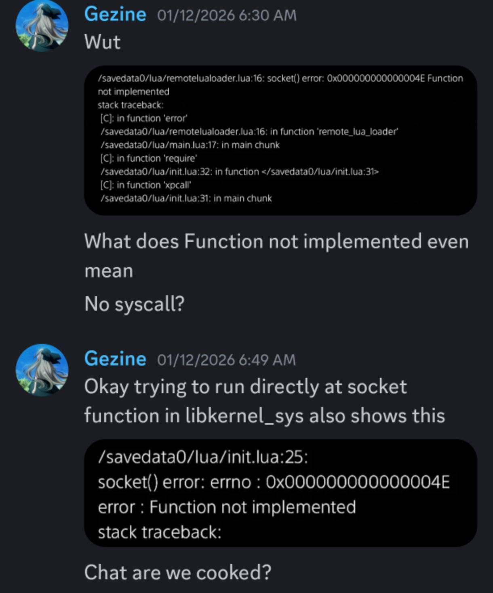  

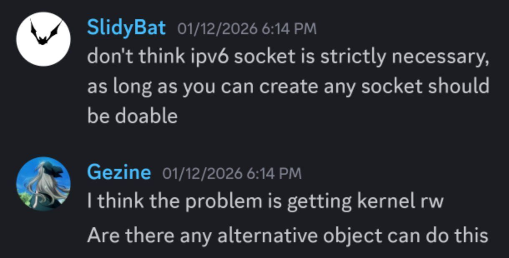  

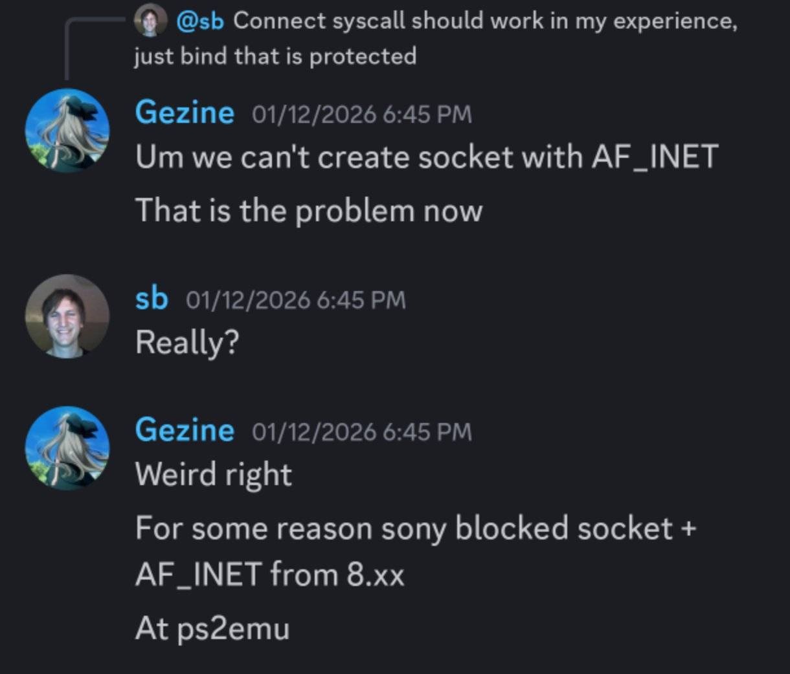  

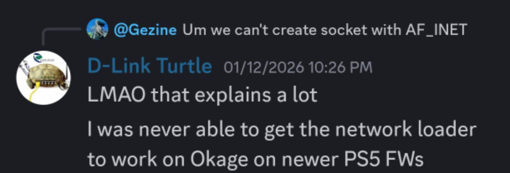  

This lead Gezine into working on the JIT exploit. This exploit would allow to run the kernel exploit anyway. And on completion it did.

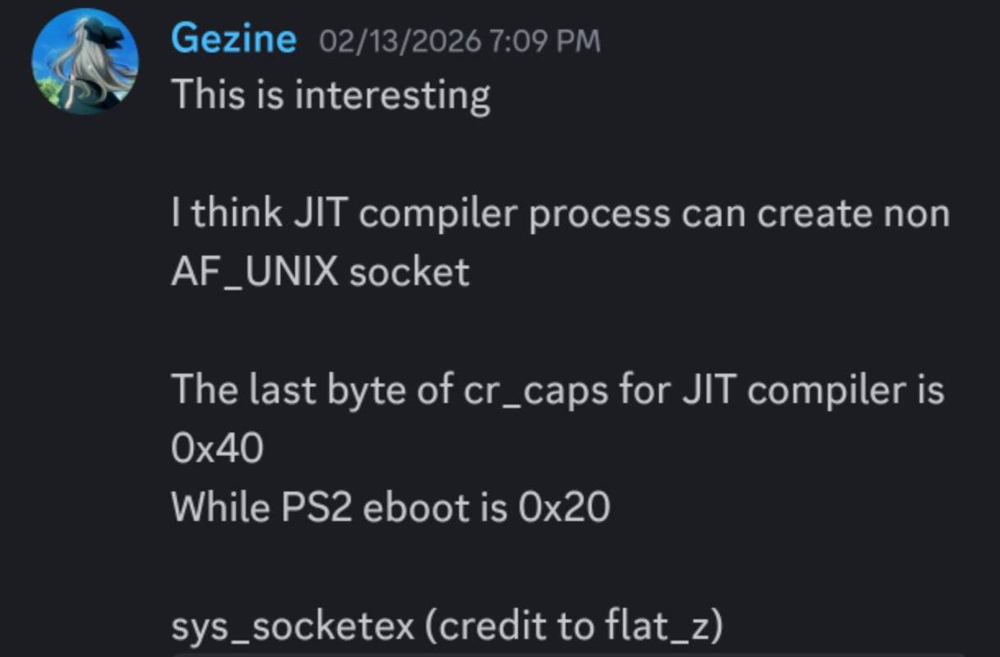  

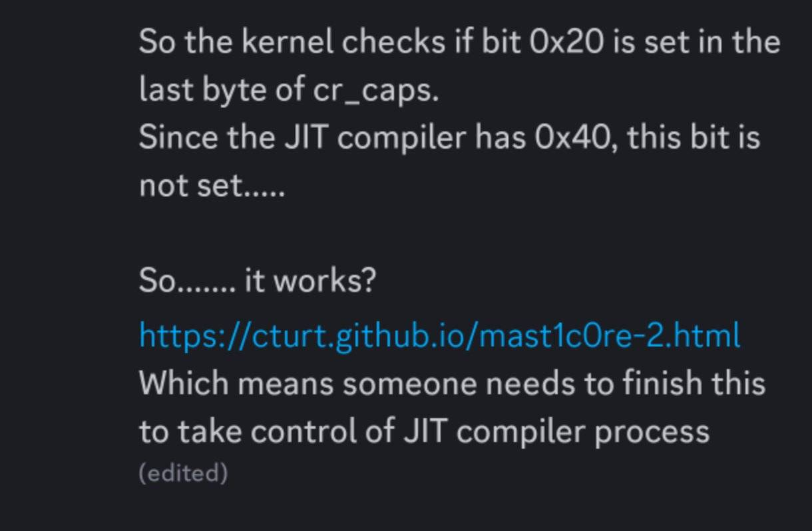  

Upon completion of the JIT exploit Gezine had a thought he shared which lead to a small discussion. 
He thought of taking a look at the Ps2emu of the other games to see if the JIT exploit would be compatible with them. 
And he found the thing that wraps up how difficult and how lucky the situation is. 

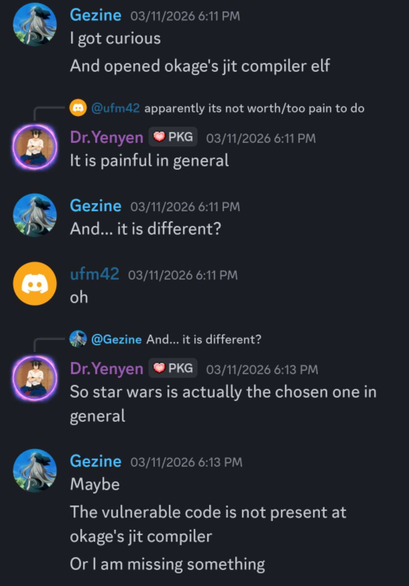  

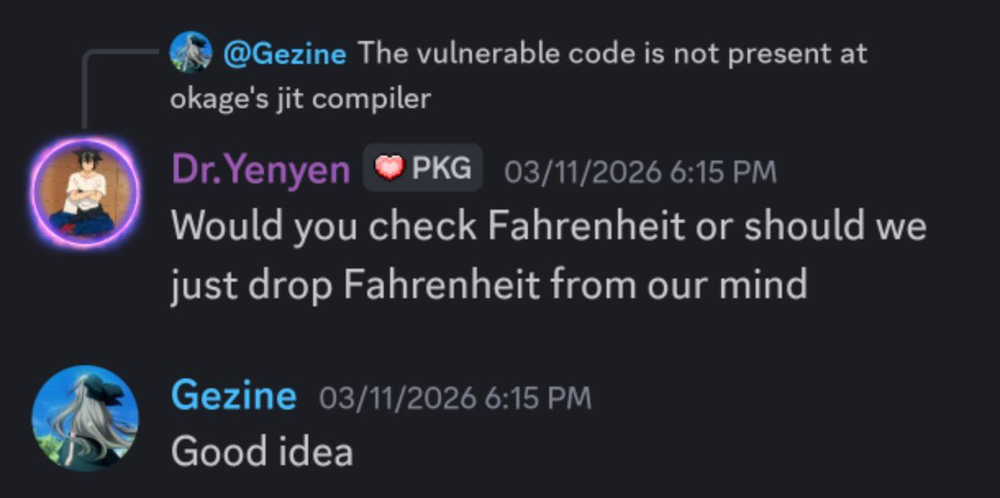  

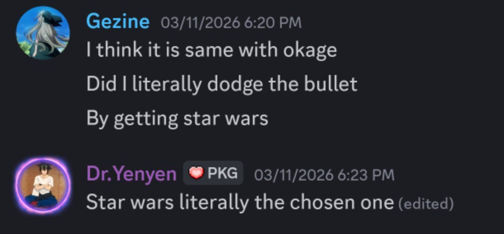  

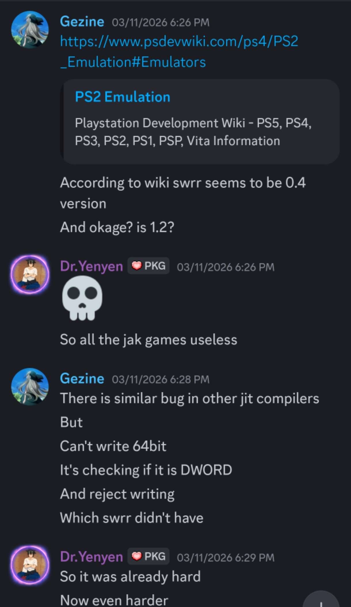  

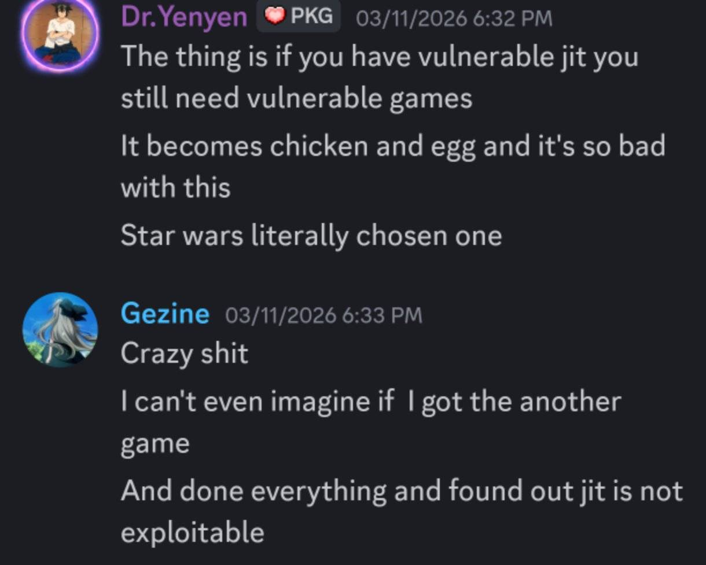  

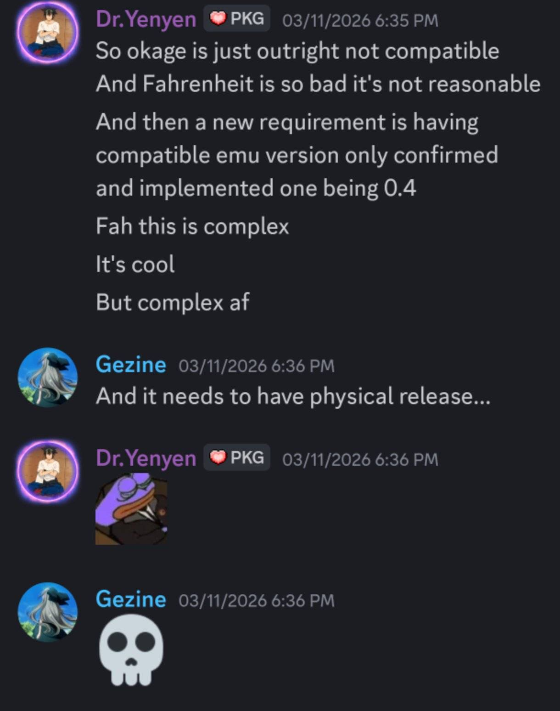  

Star wars is one of a few games that is vulnerable to the JIT exploit. 

Okage is not.
Fahrenheit is not. 

The requirements to even think of running the kernel exploit are:
1. Have a game exploit and get to Mast1c0re userland.
2. Physical release.
3. Be compatible with the available JIT exploit. Or be ready to find another one(which may not exist so it can become a waste of time.) 

In the end if you read all of this you'll probably still think. 
It's better to look for a WebKit exploit or it's better to look for a BD-J exploit. Or even say just look for a different kernel exploit. 

All of that is still harder than the situation with ps2emu.

None of this is easy. And although I personally can empathize with wanting a jailbreak to be able to have some fun with games.
You can't always have what you want. Sometimes you have to wait. 
And a jailbreak is not something people are entitled to. 

Although TheFlow mentioned a dup alternative this is also extremely difficult and cannot be expected soon if at all.

This situation is a waiting game. And has already recently happened with the lua games where for a while they were the only option until Y2JB came along.

So you have the waiting game for a kernel exploit that works with Y2JB and similar.

I personally leave a thank you to all developers who share their work. 

Ktnxbaiii 

